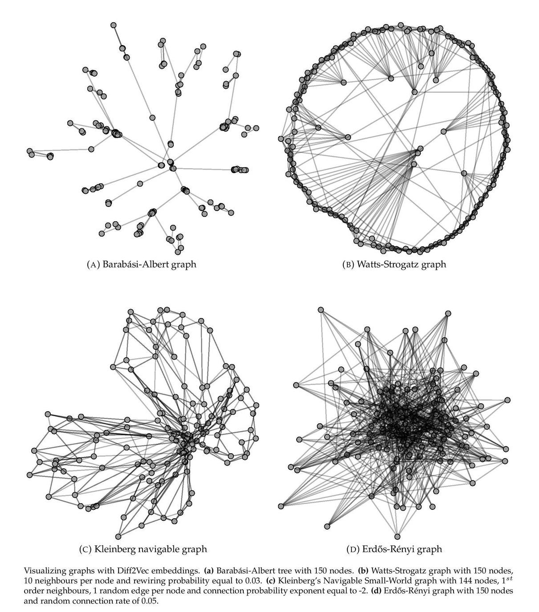

Diff2Vec
=================================================

[](https://arxiv.org/pdf/2001.07463.pdf) [](https://codebeat.co/projects/github-com-benedekrozemberczki-diff2vec-master)
[](https://github.com/benedekrozemberczki/diff2vec/archive/master.zip)⠀[](https://twitter.com/intent/follow?screen_name=benrozemberczki)⠀
<p align="justify">
A graph embedding is a representation of graph vertices in a low-dimensional space, which approximately preserves properties such as distances between nodes. Vertex sequence-based embedding procedures use features extracted from linear sequences of nodes to create embeddings using a neural network. In this paper, we propose diffusion graphs as a method to rapidly generate vertex sequences for network embedding. Its computational efficiency is superior to previous methods due to simpler sequence generation, and it produces more accurate results. In experiments, we found that the performance relative to other methods improves with increasing edge density in the graph. In a community detection task, clustering nodes in the embedding space produces better results compared to other sequence-based embedding methods. 
</p>

<p align="center">
  
</p>

The model is now also available in the package [Karate Club](https://github.com/benedekrozemberczki/karateclub).


This repository provides a reference implementation for **Diff2Vec** as described in the paper:

> [Fast Sequence Based Embedding with Diffusion Graphs](https://arxiv.org/abs/2001.07463)
> [Benedek Rozemberczki](http://homepages.inf.ed.ac.uk/s1668259/) and  [Rik Sarkar](https://homepages.inf.ed.ac.uk/rsarkar/).
> International Conference on Complex Networks, 2018.

------------------------------------

### Citing

If you find Diff2Vec useful in your research, please consider citing the following paper:
```bibtex
>@inproceedings{rozemberczki2018fastsequence,  
  title={{Fast Sequence Based Embedding with Diffusion Graphs}},  
  author={Rozemberczki, Benedek and Sarkar, Rik},  
  booktitle={International Conference on Complex Networks},  
  year={2018},  
  pages={99--107}
 }
```
### Requirements

The codebase is implemented in Python 3.5.2 | Anaconda 4.2.0 (64-bit).

```
tqdm              4.28.1
numpy             1.15.4
pandas            0.23.4
texttable         1.5.0
gensim            3.6.0
networkx          2.4
joblib            0.13.0
logging           0.4.9.6  
```

### Datasets
<p align="justify">
The code takes an input graph in a csv file. Every row indicates an edge between two nodes separated by a comma. The first row is a header. A sample graph for the `Facebook Restaurants` dataset is included in the  `data/` directory.</p>

### Options

<p align="justify">
Learning of the embedding is handled by the `src/diffusion_2_vec.py` script which provides the following command line arguments.</p>

#### Input and output options
```
  --input    STR     Path to the edge list csv.            Default is `data/restaurant_edges.csv`
  --output   STR     Path to the embedding features.       Default is `emb/restaurant.csv`
```

#### Model options
```
  --model                    STR      Embedding procedure.                      Default is `non-pooled`
  --dimensions               INT      Number of embedding dimensions.           Default is 128.
  --vertex-set-cardinality   INT      Number of nodes per diffusion tree.       Default is 80.
  --num-diffusions           INT      Number of diffusions per source node.     Default is 10.
  --window-size              INT      Context size for optimization.            Default is 10.
  --iter                     INT      Number of ASGD iterations.                Default is 1.
  --workers                  INT      Number of cores.                          Default is 4.
  --alpha                    FLOAT    Initial learning rate.                    Default is 0.025.
```

### Examples

<p align="justify">
The following commands learns a graph embedding and writes it to disk. The first column in the embedding file is the node ID.
</p>
Creating an embedding of the default dataset with the default hyperparameter settings.

```
python src/diffusion_2_vec.py
```
Creating an embedding of an other dataset the `Facebook Politicians`.

```
python src/diffusion_2_vec.py --input data/politician_edges.csv --output output/politician.csv
```
<p align="justify">
Creating an embedding of the default dataset in 32 dimensions, 5 sequences per source node with maximal vertex set cardinality of 40.</p>

```
python src/diffusion_2_vec.py --dimensions 32 --num-diffusions 5 --vertex-set-cardinality 40
```
--------------------------------------------------------------------------------

**License**

- [GNU](https://github.com/benedekrozemberczki/diff2vec/blob/master/LICENSE)

--------------------------------------------------------------------------------
